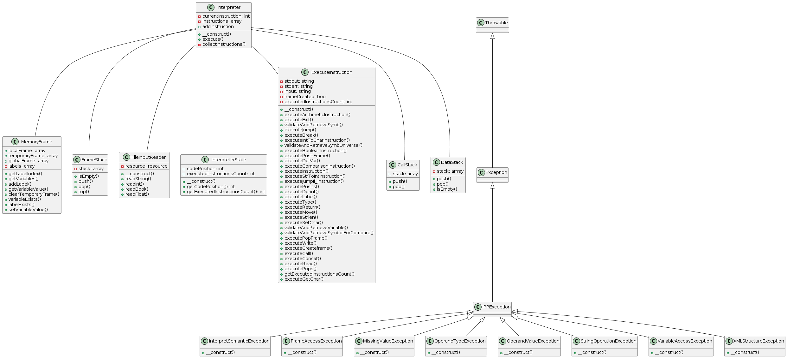

**Implementační dokumentace k 2. úloze do IPP 2023/2024**  
**Jméno a příjmení:** Veranika Saltanava  
**Login:** xsalta01  

# Introduction
This implementation documentation describes the design, implementation, and philosophy of the solution for the interpret.php script for task 2 within the IPP subject. The interpret.php script is implemented in PHP and is used to interpret code in XML format representing an instruction tape. The goal of the script is to load and execute instructions according to the given XML file and output the result to standard output.

# Design Philosophy

The design philosophy of the interpret.php script is based on modularity, readability, and maintainability. Each part of the code is divided into separate functions with a clearly defined purpose and responsibility. Comments are used to document the code and explain specific parts of the implementation.

# Internal Representation

The internal representation of the program is based on classes and objects that represent individual parts of the instruction tape, memory frames, and the interpreter. The fundamental class is `Interpreter`, which handles loading the XML file, interpreting instructions, and managing memory frames.

Instructions are internally represented using an associative array, where keys correspond to individual attributes of the instruction (e.g., opcode, argTypes, argValues). The `MemoryFrame` class is used to store variables and memory frames, allowing for adding, deleting, and modifying variables within different memory frames. Memory frames maintain the state of variables and their values in different parts of the program. The instruction array contains all program instructions, which are sequentially executed by the interpreter.

# Specific Solution Approach

- Specific methods were created in the `executeInstruction` class for the implementation of individual instructions.
- Helper methods were created for the validation and processing of instruction arguments, ensuring the correct types of arguments and retrieving their values.
- Utilization of the `MemoryFrame` and `FrameStack` classes for memory frame management and frame stack management.
- Implementation of the `FileInputReader` class for reading input data from a file.
- Use of exceptions for error handling and unexpected situations.

# UML Class Diagram

